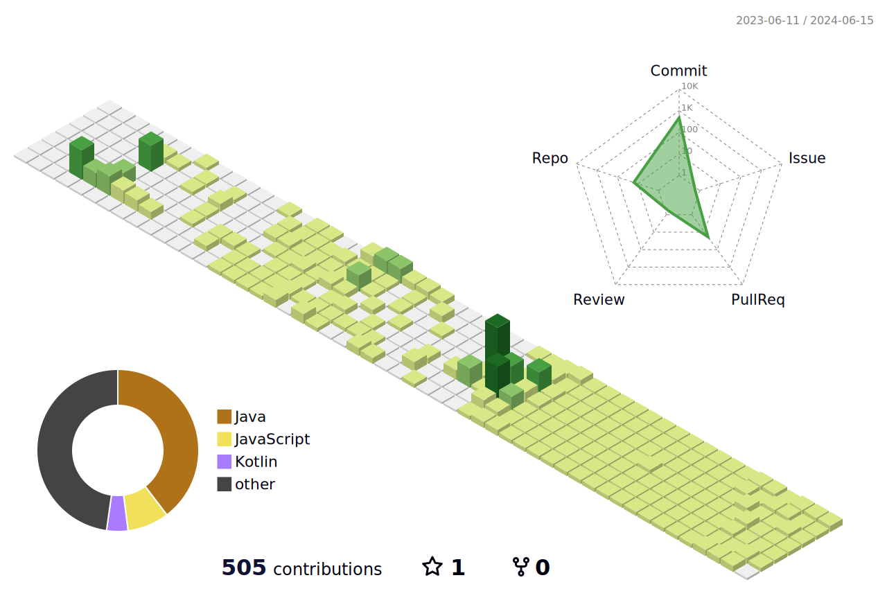

<!--
헤더
https://github.com/kyechan99/capsule-render/blob/master/docs/README_kr.md

    

-->

<!--

 
-->

<!--
방문자수
https://hits.seeyoufarm.com/

-->

<!--
언어 사용 통계
https://github.com/anuraghazra/github-readme-stats/blob/master/docs/readme_kr.md

-->

<!--

-->

### Contact 📞

    
    

  

### My Skills ⚒️

    <!-- Backend -->
    
<strong>Backend</strong>

    

         
         
    

    <!-- Database -->
    
<strong>Database</strong>

    

         
         
    

    <!-- etc -->
    
<strong>etc</strong>

    

         
         
    

    <!-- Frontend -->
    
<strong>Frontend</strong>

    

         
        
         
    

    <!-- Others
    
<strong>Others</strong>

    

        
    

     -->

  

### DEV's log 💻

    

 

  

<!--
GitHub 통계
https://github.com/anuraghazra/github-readme-stats/blob/master/docs/readme_kr.md
-->

### My Github Stats

<!--

-->
