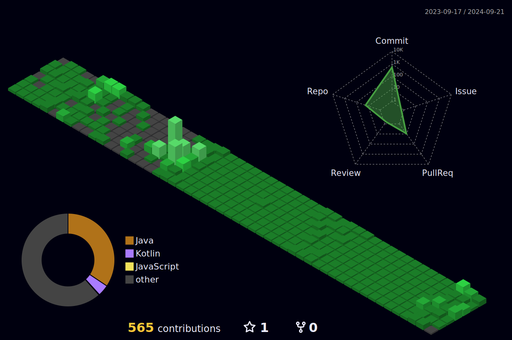

<!--
헤더
https://github.com/kyechan99/capsule-render/blob/master/docs/README_kr.md

    

-->

### Contact ✉️

    
    

### My Skills ⚒️

    <strong>Backend</strong>
    

        
        
    

    <strong>Database</strong>
    

         
         
    

    <strong>etc</strong>
    

         
         
    

    <strong>Frontend</strong>
    

         
        
         
    

### Studying 📖

### DEV's log 💻
<!--

-->

<!--
    

-->
